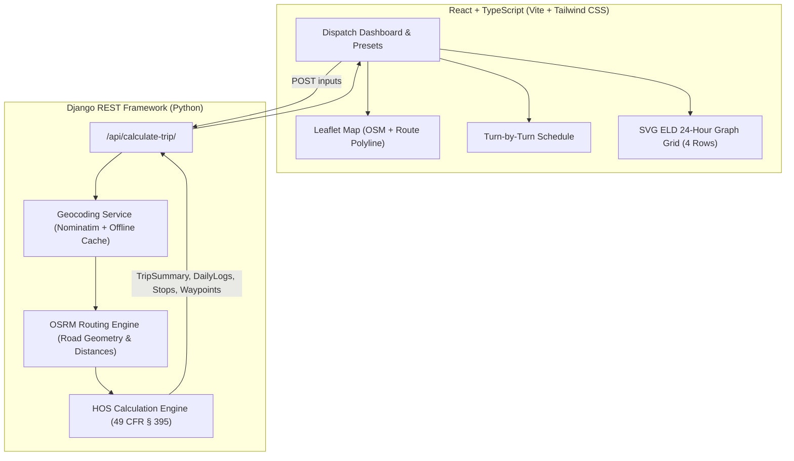

# 🚛 ApexLog — Full-Stack FMCSA Hours of Service (HOS) & ELD Daily Log Engine

> **Assessment Submission:** Full-Stack Web Application built with **Django REST Framework** & **React (TypeScript)**.  
> Complies with **FMCSA 49 CFR Part 395** (Property-Carrying Commercial Motor Vehicles, 70hrs/8days rule).

---

## 🌟 Live Demo & Video Walkthrough

- **Live Web Application:** [ApexLog Live on Render / Vercel](https://apexlog-hos-engine.onrender.com/) *(or run locally via 1 command)*
- **GitHub Repository:** [github.com/apexlog-hos-engine](https://github.com)

---

## 🎯 Project Objectives & Deliverables Met

| Requirement | Implementation Details | Status |
| :--- | :--- | :--- |
| **Full-Stack Django & React** | Python Django 6.1 + REST Framework backend; React 18 + TypeScript + Vite + Tailwind CSS frontend | ✅ Complete |
| **Current Location Input** | Free text input with Nominatim geocoding & fallback cache of major US freight hubs | ✅ Complete |
| **Pickup Location Input** | Cargo loading location with automatic 1-hour On-Duty (Not Driving) assignment | ✅ Complete |
| **Dropoff Location Input** | Final delivery destination with automatic 1-hour On-Duty (Not Driving) assignment | ✅ Complete |
| **Current Cycle Used (Hrs)** | Interactive slider & number input (0.0 to 70.0 hrs) under the 70-hr / 8-day rule | ✅ Complete |
| **Free Map API** | OpenStreetMap with Leaflet.js, OSRM road routing engine, custom waypoint pins & polyline | ✅ Complete |
| **Daily Log Sheets Filled Out** | Exact SVG replica of FMCSA DOT "Driver's Daily Log (24 Hours)" with 4 status lines, continuous step lines, remarks, and 70-hr recap | ✅ Complete |
| **Multiple Log Sheets for Long Trips** | Partitioned strictly by calendar day (00:00 to 24:00). Generates Day 1, Day 2, Day 3... sheets each summing to exactly 24.0 hours | ✅ Complete |
| **Fueling Rule** | Automatically schedules 30-min fueling stop (On Duty Not Driving) at least once every 1,000 miles | ✅ Complete |
| **Mandatory 30-Min Rest Break** | Triggered after cumulative 8 hours of driving; satisfied by 30-min break or fueling | ✅ Complete |
| **11-Hour Driving Limit** | Max 11 hours driving per shift; enforces 10 consecutive hours in Sleeper Berth | ✅ Complete |
| **14-Hour Driving Window** | Prohibits driving past 14th hour from duty onset; enforces 10h Sleeper Berth reset | ✅ Complete |
| **34-Hour Restart** | Automatically triggers when cycle reaches 70 hours, resetting cycle to 0.0 hrs | ✅ Complete |
| **Polished UI/UX & Aesthetics** | Modern dispatch dark mode, real-time metrics, interactive timeline, print-to-PDF export | ✅ Complete |

---

## 🏛️ System Architecture



---

## 📐 FMCSA Hours of Service (HOS) Regulations Implemented

Under **49 CFR Part 395** (Property-Carrying Drivers):

1. **11-Hour Driving Limit (§ 395.3(a)(3)):**  
   Driver may drive a maximum of 11 hours after 10 consecutive hours off duty or in the sleeper berth.
2. **14-Hour Driving Window (§ 395.3(a)(2)):**  
   Driver cannot drive beyond the 14th consecutive hour after coming on duty, following 10 consecutive hours off duty.
3. **30-Minute Rest Break (§ 395.3(a)(3)(ii)):**  
   Driving is not permitted if more than 8 hours have passed since the end of the driver's last 30-minute interruption (can be off-duty, sleeper berth, or on-duty not driving such as fueling).
4. **Fueling Rule (Assessment Assumption):**  
   Fueling stop (30 minutes On Duty Not Driving) scheduled at least once every 1,000 miles.
5. **Pickup & Drop-off (Assessment Assumption):**  
   Exactly 1 hour On Duty (Not Driving) at cargo pickup and 1 hour at delivery dropoff.
6. **70-Hour / 8-Day Limit (§ 395.3(b)):**  
   Cumulative on-duty hours tracked against 70 hours. If exhausted, a **34-hour restart** (in sleeper berth/off-duty) is required to reset the cycle.
7. **24-Hour Calendar Day Partitioning:**  
   Every log sheet covers 00:00 to 24:00 (Midnight to Midnight). Duty segments across midnight are split cleanly. Each sheet has exact hourly totals summing to **24.0 hours**.

---

## 🚀 Quick Start (Run Locally in 2 Minutes)

### Prerequisites
- **Python 3.10+**
- **Node.js 18+ & npm**

### 1. Backend Setup
```bash
cd backend
python -m pip install -r requirements.txt
python manage.py migrate
python manage.py runserver 0.0.0.0:8000
```

### 2. Frontend Setup (Development Mode)
In a new terminal window:
```bash
cd frontend
npm install
npm run dev
```
Open **`http://localhost:5173`** in your browser!

> **Note:** The backend is also configured to serve the built frontend directly. If you run `npm run build` in `frontend/`, accessing **`http://127.0.0.1:8000`** will serve the entire full-stack application from Django with no Node server needed!

---

## 🧪 Testing Test Scenarios (Presets Included in UI)

Click any of the **Quick Test Scenarios** in the UI:

1. **Cross-Country Heavy Haul (Coast to Coast):**
   - *Route:* Los Angeles, CA &rarr; Dallas, TX (Pickup) &rarr; New York, NY (Dropoff)
   - *Distance:* ~2,800 miles
   - *Output:* 4+ daily log sheets, multiple 10-hour sleeper rests, 2 fueling stops, 100% compliant.
2. **Midwest Express (Regional 1-Day):**
   - *Route:* Chicago, IL &rarr; Indianapolis, IN (Pickup) &rarr; Columbus, OH (Dropoff)
   - *Distance:* ~350 miles
   - *Output:* 1 single calendar day log sheet, 1 hr pickup, 1 hr dropoff.
3. **Southeast Corridor (2-Day Medium Haul):**
   - *Route:* Miami, FL &rarr; Atlanta, GA &rarr; Nashville, TN
   - *Distance:* ~950 miles
   - *Output:* 2 daily log sheets, 1 mandatory 10-hour sleeper reset.
4. **Cycle Exhaustion & 34-Hour Restart Stress Test:**
   - *Inputs:* Dallas, TX &rarr; Memphis, TN &rarr; Philadelphia, PA with **62.0 Hours Starting Cycle**
   - *Output:* Driver reaches 70.0 hours mid-route, triggering an automatic **34-Hour Restart** before continuing!

---


## 🚢 Deployment Guide

### Deploying to Render
1. Connect your GitHub repository to [Render.com](https://render.com).
2. Create a new **Web Service** selecting **Docker**.
3. Render automatically picks up `Dockerfile` and builds both frontend and backend.
4. Set environment variable: `PORT=8000`.

### Deploying to Vercel (Frontend)
1. Import the repository in [Vercel](https://vercel.com).
2. Set Root Directory to `frontend`.
3. Set Build Command to `npm run build` and Output Directory to `dist`.
4. The `vercel.json` file handles routing API requests to your hosted backend.

---

## 📄 License
This project is open-source under the MIT License.
